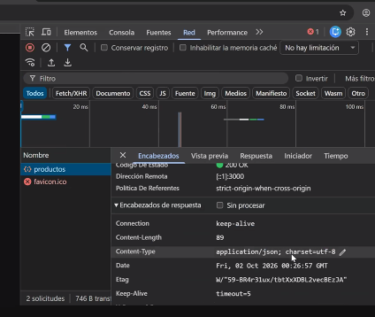
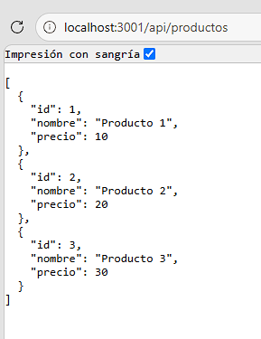
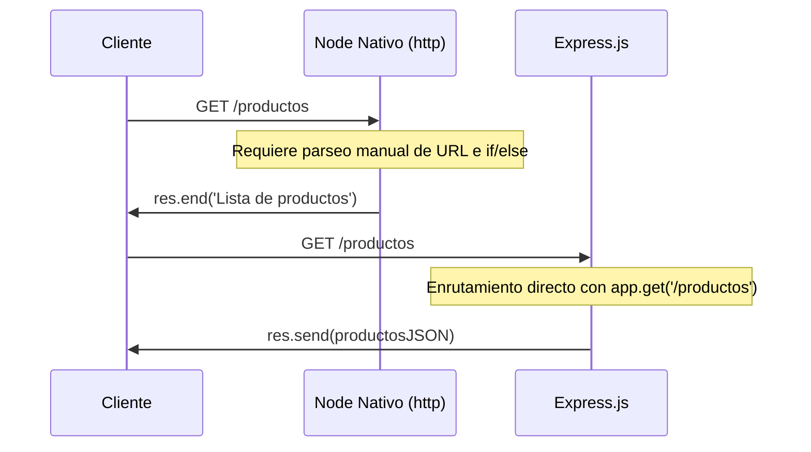
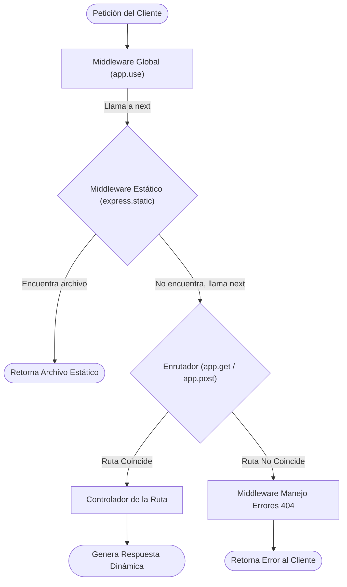

# Clase 09 - API de Backend con Express

## Analisis del Proyecto

Este proyecto consiste en la creacion de un servidor web basico utilizando Node.js y el framework Express. En el archivo principal, se puede observar la transicion desde el uso del modulo nativo `http` (el cual se encuentra comentado) hacia una implementacion mas moderna y practica con Express, lo que simplifica considerablemente el enrutamiento y la gestion de solicitudes.

El entorno esta configurado para utilizar modulos de ES6 (gracias a la configuracion en el package.json) y el servidor expone dos rutas principales:

* **Ruta raiz (`/`)**: Devuelve un mensaje de texto plano confirmando el funcionamiento de la API.
* **Ruta de productos (`/api/productos`)**: Devuelve un arreglo de objetos en formato JSON que representa un listado de productos de prueba.

El servidor escucha las peticiones a traves del puerto 3001. Ademas, el proyecto tiene configurados scripts para facilitar el desarrollo, utilizando dependencias como `nodemon` para que el servidor se reinicie automaticamente cuando se realicen cambios en el codigo fuente.

## Imagenes

A continuacion se presentan las imagenes generadas correspondientes a la API y el entorno:

### Herramientas
Vista de las herramientas de desarrollo y el entorno de trabajo configurado para el servidor web.

### Productos
Visualizacion de la respuesta de la API al solicitar la ruta de productos, retornando el listado en formato JSON.

## Scripts Disponibles

En este proyecto puedes ejecutar los siguientes comandos:

* `npm start`: Inicia la aplicacion utilizando Node.js de forma estandar.
* `npm run dev`: Inicia el entorno de desarrollo utilizando Nodemon para la recarga automatica de los archivos.

## Análisis de la Clase 9 (Basado en el PDF)

A continuación, se detalla el análisis del contenido teórico y práctico cubierto en el documento de la clase.

### 1. Servidor Web: Node Nativo vs Express.js

Inicialmente, levantar un servidor web utilizando el módulo nativo `http` de Node.js requiere un manejo manual de las rutas y tipos de contenido. **Express.js** soluciona esto al ser un framework minimalista que ofrece:
* **Simplicidad:** API intuitiva para definir rutas (`app.get()`, `app.post()`).
* **Flexibilidad:** Uso de middlewares para extender funcionalidades.

#### Diagrama de Secuencia: Comparativa de Peticiones

### 2. Servidor de Archivos Estáticos

Express permite servir recursos estáticos (HTML, CSS, JS, imágenes) desde una carpeta, generalmente llamada `public`. Esto se logra configurando el middleware integrado `express.static`.

### 3. Middlewares: El Corazón de Express

Los **middlewares** son funciones que interceptan las peticiones antes de llegar a la ruta final. Tienen acceso a la petición (`req`), la respuesta (`res`) y a la función `next()` para pasar el control al siguiente middleware en la cadena.

Existen varios tipos:
* **De aplicación:** Globales para toda la app.
* **De ruta:** Específicos para un endpoint.
* **De terceros:** Librerías externas (ej. `cors`).
* **Integrados:** Como `express.static`.

#### Diagrama de Flujo: Ciclo de Vida con Middlewares

### 4. Express Generator y Misiones

Para proyectos escalables, **Express Generator** crea automáticamente la estructura base (`routes`, `views`, `public`).
La clase culmina con misiones prácticas para configurar `npm init`, Git, `.gitignore` y el primer servidor básico en el puerto `3000` con Express.
