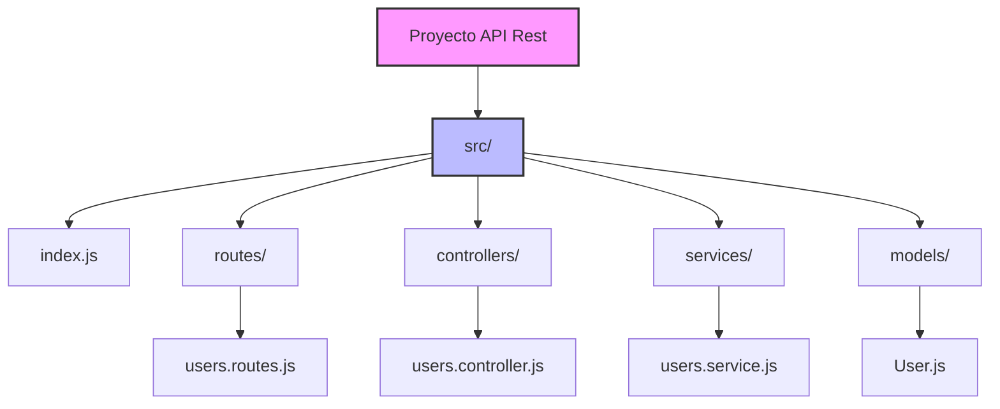
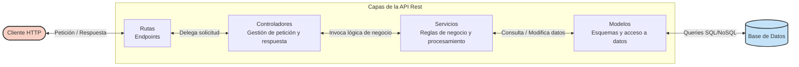

# Clase N 10 - Modelando una API Rest

## Temario
1. API Rest
2. Estructura de archivos
3. Capas de la aplicación
4. División de responsabilidades

## Objetivos de la Clase
El objetivo principal es comprender los fundamentos del modelado de una API Rest y aplicarlos en un proyecto práctico. Se busca adquirir una visión clara sobre la estructura de archivos necesaria para organizar el código de manera eficiente, comprendiendo la importancia de definir capas dentro de la aplicación para facilitar la escalabilidad y el mantenimiento. Además, se enfatiza la correcta división de responsabilidades dentro de cada capa mediante principios de diseño.

---

## 1. API Rest
Una API Rest (Representational State Transfer) es un estilo de arquitectura que permite la comunicación entre sistemas a través del protocolo HTTP.

**Características principales:**
- **Basada en recursos:** Trabaja con recursos (datos o entidades como productos, usuarios, etc.). Cada recurso tiene una URL única.
- **Métodos HTTP:** Se utilizan comandos estándar para interactuar con los recursos:
  - `GET`: Obtener información.
  - `POST`: Agregar algo nuevo.
  - `PUT` / `PATCH`: Modificar información.
  - `DELETE`: Eliminar recursos.
- **Independencia (Stateless):** Cada interacción es independiente. El cliente envía toda la información necesaria en cada solicitud, por lo que el servidor no necesita recordar estados previos, facilitando el manejo de múltiples solicitudes simultáneas.
- **Formato de datos:** Generalmente se utiliza JSON, un formato legible para máquinas y humanos, permitiendo la comunicación entre sistemas desarrollados en diferentes tecnologías.

---

## 2. Estructura de archivos
Definir una buena estructura de carpetas es crucial antes de comenzar a codificar. Una estructura basada en capas es ideal para APIs Rest desarrolladas en Node.js con Express, ya que permite escalar el proyecto dividiendo responsabilidades.

A continuación se presenta un diagrama ilustrando una estructura escalable recomendada:

**Descripción de directorios:**
- `src/`: Contiene los archivos principales y de configuración.
- `routes/`: Configuración de las rutas o "puntos de entrada" de la API.
- `controllers/`: Define qué debe suceder cuando se accede a las rutas.
- `models/`: Conexión con la base de datos y definición de la estructura de los datos.
- `services/`: Contiene la lógica de negocio, independiente de la base de datos o de las respuestas HTTP.

---

## 3. Capas de la aplicación
Dividir la aplicación en capas asigna propósitos específicos a cada parte del sistema, logrando un funcionamiento más ordenado, eficiente y fácil de mantener en equipo.

El siguiente diagrama ilustra cómo fluye una petición desde que el cliente la realiza hasta que interactúa con la base de datos a través de las diferentes capas:

### Rutas (Routes)
Son los puntos de entrada (endpoints) que los clientes utilizan para interactuar con la API. Combinan una URL con un método HTTP. Se suelen organizar en archivos específicos, por ejemplo, `users.routes.js`.

### Controladores (Controllers)
Actúan como puente entre las rutas y la aplicación.
- Reciben las solicitudes de las rutas.
- Procesan y deciden qué hacer con ellas.
- Delegan la lógica compleja a los servicios o interactúan con los modelos.
- Manejan los errores y envían la respuesta final al cliente.
Mantienen su enfoque en coordinar, sin contener lógica de negocio compleja.

### Modelos (Models)
Son los "planos" que describen la estructura y comportamiento de los datos.
- Definen cómo lucen las entidades (ej. propiedades de un Producto).
- Facilitan el acceso y manipulación de información en bases de datos (SQL, NoSQL, o incluso archivos locales mediante la librería `fs`).
- Garantizan consistencia en los datos.

### Servicios (Services)
Son los motores de la aplicación encargados de la lógica de negocio.
- Se sitúan entre los controladores y los modelos.
- Reciben peticiones del controlador, aplican reglas de negocio (validaciones, filtros, procesamiento) y se comunican con los modelos para obtener o guardar datos.
- Evitan que los controladores o modelos se sobrecarguen de responsabilidades, mejorando la escalabilidad del código.

---

## 4. División de responsabilidades
Planificar las capas y la estructura de directorios busca crear aplicaciones mantenibles y escalables. La división de responsabilidades asegura que cada parte del código tenga un propósito definido, evitando archivos gigantes y desordenados.
El uso de módulos es fundamental en este proceso, permitiendo exportar e importar fragmentos de código de forma ordenada y controlando dónde se utiliza cada recurso.

---

## Ejercicio Práctico: Estructura y Rutas de la API

**Misión del ejercicio:**

1. **Crear la estructura de directorios:**
   Construye la arquitectura base para la API creando las siguientes carpetas dentro de tu proyecto:
   - `routes`
   - `controllers`
   - `models`
   - `services`

2. **Crear rutas en el archivo principal (`index.js`):**
   Añade dos rutas nuevas directamente en el archivo principal (aún no es necesario separarlas en la carpeta `routes`):
   - Una ruta que devuelva una respuesta en formato HTML (ej. una página de bienvenida).
   - Una ruta que devuelva una respuesta en formato JSON (ej. una lista ficticia de usuarios o productos).

### Materiales y Recursos Adicionales sugeridos
- Guía de Arquitectura REST.
- Tutoriales sobre creación de APIs RESTful con Express y Node.js.
- Tutoriales sobre creación de APIs RESTful con Express y Node.js.